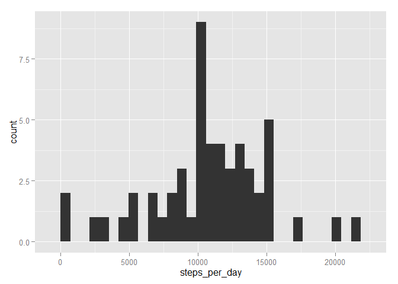
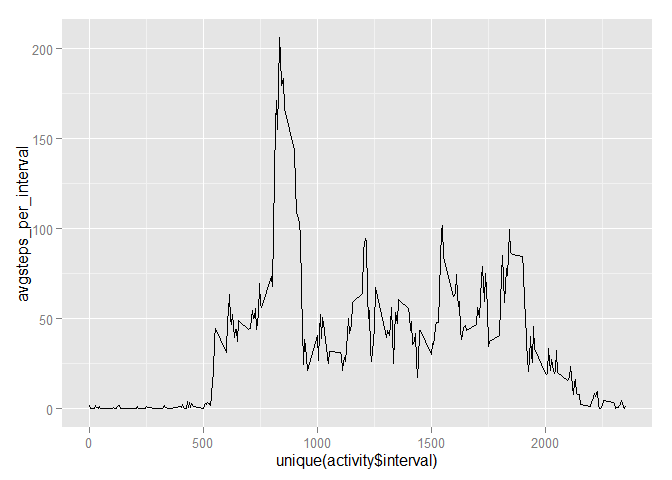
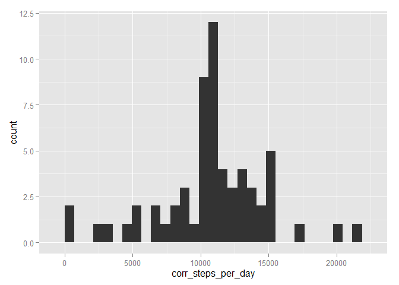
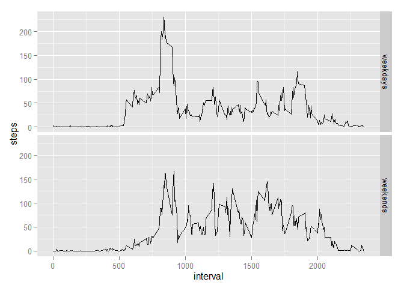

# Reproducible Research: Peer Assessment 1


## Loading and preprocessing the data

```r
activity <- read.csv("activity.csv")
activity$date <- as.Date(activity$date)
```

## What is mean total number of steps taken per day?
The mean total number of steps taken per day ignoring the missing values in the dataset:

```r
steps_per_day <- tapply(activity$steps[!is.na(activity$steps)], activity$date[!is.na(activity$steps)], sum)
```


```r
library(ggplot2)
qplot(steps_per_day, geom="histogram")
```

 


```r
mean <- mean(steps_per_day)
median <- median(steps_per_day)
```
The mean and median of the total number of steps taken per day are **mean=1.0766189\times 10^{4}** and **median=10765**.

## What is the average daily activity pattern?

```r
avgsteps_per_interval <- tapply(activity$steps[!is.na(activity$steps)], activity$interval[!is.na(activity$steps)], mean)
qplot(unique(activity$interval), avgsteps_per_interval, geom="path")
```

 

The 5-minute interval that contains the maximum number of steps on average across all the days in the dataset:

```r
unique(activity$interval)[avgsteps_per_interval == max(avgsteps_per_interval)]
```

```
## [1] 835
```


## Imputing missing values
The total number of rows with NAs:

```r
nrow(activity) - sum(complete.cases(activity))
```

```
## [1] 2304
```
###Strategy: The mean for that 5-minute intervals is used for filling in all of the missing values in the dataset.

The data frame below contains the interval IDs and the mean values for that 5-minute intervals:

```r
avgsteps_per_interval <- data.frame((rownames(avgsteps_per_interval)), as.vector(avgsteps_per_interval))
```

A function is defined that renders the mean value to the interval ID.

```r
complete_steps <- function(interval) {avgsteps_per_interval[avgsteps_per_interval[,1] == interval, 2]}
```

This function is applied to all the data where there is an NA, and the corrected values are stored in `activity$corr_steps`.

```r
activity$corr_steps <- activity$steps
activity$corr_steps[is.na(activity$steps)] <- tapply(activity$interval[is.na(activity$steps)], c(1:sum(is.na(activity$steps))), complete_steps)
```

The mean total number of steps taken per day after correction:

```r
corr_steps_per_day <- tapply(activity$corr_steps, activity$date, sum)
```


```r
library(ggplot2)
qplot(corr_steps_per_day, geom="histogram")
```

 


```r
corr_mean <- mean(corr_steps_per_day)
corr_median <- median(corr_steps_per_day)
```
The mean and median of the total number of steps taken per day after correction are **mean=1.0766189\times 10^{4}** and **median=1.0766189\times 10^{4}**.

###Comparison with the results of the first part of the assignment:

Due to the applied startegy

*  the median got equal to the mean and the mean remained the same,
*  the value of the median became unreasonable (should be an integer),
*  the total daily number of steps increased.

## Are there differences in activity patterns between weekdays and weekends?

A new factor variable created with two levels (weekday and weekend):

First the system settings changed to have English names for the days.

```r
Sys.setlocale("LC_TIME", "C")
```

```
## [1] "C"
```

```r
activity$day_type <- "weekday"
activity$day_type[weekdays(activity$date) == "Saturday" | weekdays(activity$date) == "Sunday"] <- "weekend"
```

###Panel plot for the comparison of steps taken on weekday days and weekend days:

```r
steps_weekdays <- as.vector(tapply(activity$corr_steps[activity$day_type == "weekday"], activity$interval[activity$day_type == "weekday"], mean))
steps_weekends <- as.vector(tapply(activity$corr_steps[activity$day_type == "weekend"], activity$interval[activity$day_type == "weekend"], mean))
steps <- c(steps_weekdays, steps_weekends)
interval <- c(unique(activity$interval), unique(activity$interval))
daytype <- c(rep("weekdays", length(unique(activity$interval))), rep("weekends", length(unique(activity$interval))))
qplot(interval, steps, facets = daytype~., geom = "line")
```

 
